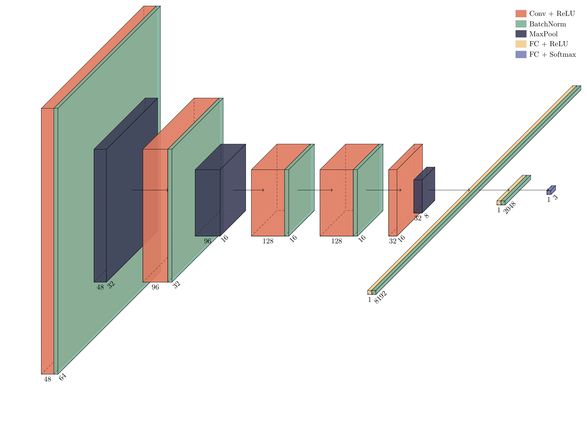

# BreadRx

The proof is in the crumb?

### Overview

Building off Justin Kolpak's model detailed in his Medium article, BreadRx 
attempts to build a more robust dataset to improve the accuracy of predicting whether
a loaf of bread is over, under, or well-proofed. 


### Usage

- pip install -e .

Installing dependencies:
```
$ 
```

Available as a CLI:
```
$ breadrx -f bread.jpg
> over-proofed with probability 0.74
> inference time: 3.22 sec. 
```

### Data

A full overview of the dataset used in training can be found on [Huggingface](https://huggingface.co/datasets/camfruss/bread_proofing). 

In short, 2,880 images were collected from the subreddits r/Sourdough and r/Breadit and classified as
over, under, or well-proofed using OpenAI's API. 

### Training

#### Convolutional Neural Network

The CNN model architecture is based off of AlexNet: 

<p align="center">
 
</p>

### Analysis

A class activation map was generated based on the last fully connected layer. 
While the most influential pixels generally coincide with the loaf, it appears the background
is creating a fair amount of noise in the model. This is one possible explanation for the current
subpar performance of the model. We suggest a possible remedy for this in Future Improvements. 

<p align="center">
 
</p>


### Further Questions

1. Other data sources? 
2. Adversarial Data Augmentation?
3. Expanding criteria for acceptable Reddit posts?


### Future Improvements

- [ ] Modularize `dim`, `is_grayscale`
- [ ] Calculate bias-variance tradeoff to determine whether more data would improve accuracy
- [ ] Use connected components to isolate crumb image from background to reduce noise
- [ ] Reduce over-fitting
- [ ] Add MLFlow experiment tracking
- [ ] Compare results with a fine-tuned LLM (either using torchtune or OpenAI API)
- [ ] Add website
- [ ] Experiment with different loss functions and optimizers
